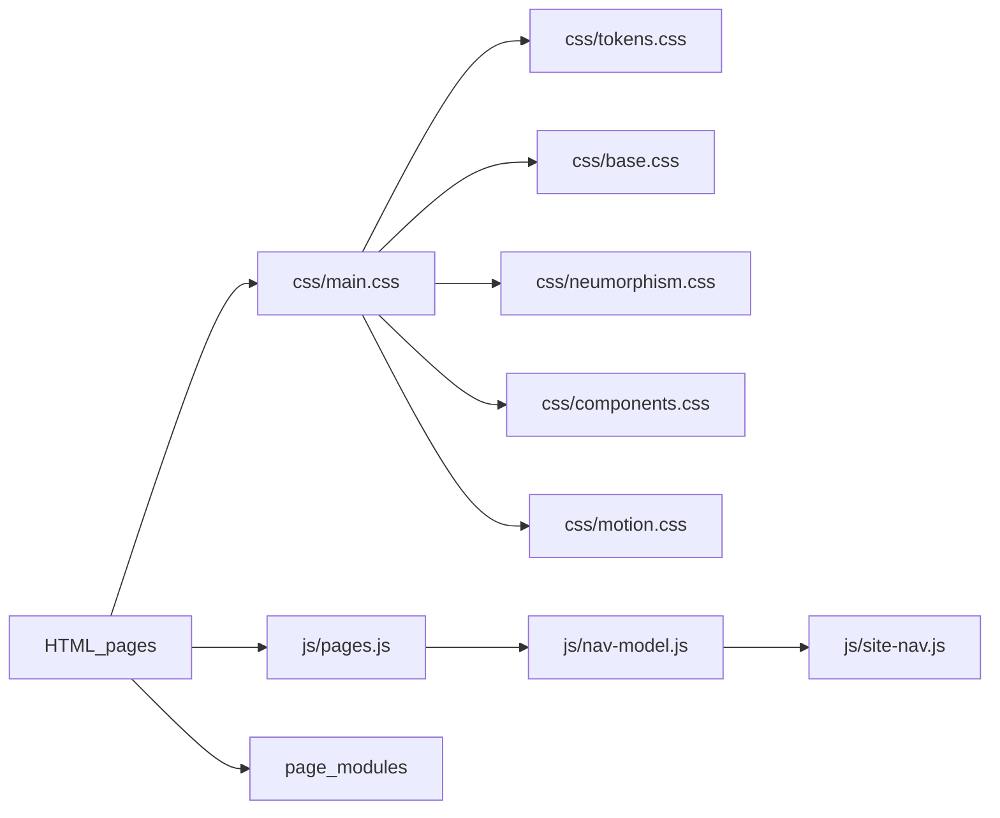

# Architecture

## Delivery model

This is a **static** portfolio. Vercel serves HTML, CSS, JavaScript, and media
from the repository root. There is no server-side app, database, or production
build step.

[`vercel.json`](../vercel.json) enables `cleanUrls: true`, so `/tech` resolves to
`tech.html` (and `/` to `index.html`). Navigation and the page registry use these
clean paths. Cache headers keep CSS/JS revalidating and pin long-lived caching on
images.

## Layers

| Layer | Location | Role |
|-------|----------|------|
| Pages | `*.html` | Content shells; set `active-page` on `<site-nav>` |
| Design system | `css/tokens.css` | Colors, type, space, shadow, motion SSoT |
| CSS entry | `css/main.css` | `@import` order for all layers |
| Nav | `js/pages.js`, `nav-model.js`, `site-nav.js` | Registry → pure model → `<site-nav>` |
| Shared UI | `site-footer.js`, `preloader.js`, `neumorphic-scrollbar.js`, `asset-guard.js` | Cross-page behavior |
| Page modules | `hero.js`, `hero-chips.js`, `terminal.js`, `tech-albums.js`, … | Page-specific enhancement |
| Media | `assets/images/` | Photos, certificates, brand marks |
| Quality | `tests/unit/`, `scripts/qa-*.mjs` | Unit/property tests + static QA |

## Page registry and routing

[`js/pages.js`](../js/pages.js) is the single source of truth for nav order and
hrefs (`/`, `/tech`, `/travel`, `/life`, `/designs`). Array order is both display
order and the intended content build order.

- `tier: "primary"` → top-level link  
- `tier: "overflow"` → “More” menu  

Each HTML page sets `active-page` to the matching `id`. Adding a page requires
updating the registry, a new HTML file, tests, LHCI URLs, and lychee fallbacks —
see [ADD_A_PAGE.md](ADD_A_PAGE.md).

## Deployment flow

1. Push to GitHub (`main` or a PR).
2. Vercel deploys the static root (no build command).
3. GitHub Actions run QA, Lighthouse, link check, and npm audit (see [CI.md](CI.md)).

## CI map

| Workflow | Gate |
|----------|------|
| Portfolio QA | `npm run qa` (static + responsive + Vitest) |
| Lighthouse Audit | Accessibility **error** ≥ 0.9; other categories warn |
| Link Check | Lychee over HTML/Markdown with clean-URL fallbacks |
| Dependency Security Audit | `npm audit --audit-level=high` |

`@lhci/cli` is **not** a package dependency (its transitive tree fails
`npm audit --audit-level=high`). CI pins it with `npx @lhci/cli@0.15.1`.
